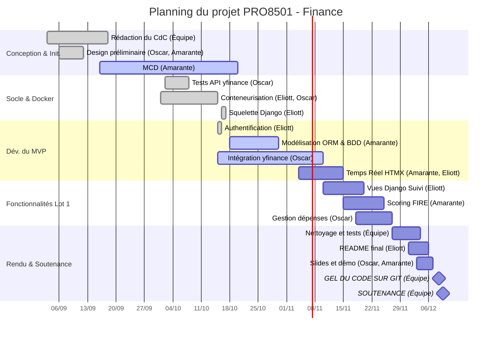

```mermaid
gantt
    title Planning du projet PRO8501 - Finance
    dateFormat  YYYY-MM-DD
    axisFormat  %d/%m

    section Conception & Init.
    Rédaction du CdC (Équipe)             :done, 2026-09-03, 2026-09-18
    Design préliminaire (Oscar, Amarante) :done, 2026-09-06, 2026-09-12
    MCD (Amarante)                        :active, 2026-09-16, 2026-10-20

    section Socle & Docker
    Tests API yfinance (Oscar)            :done, 2026-10-02, 2026-10-08
    Conteneurisation (Eliott, Oscar)      :done, 2026-10-01, 2026-10-15
    Squelette Django (Eliott)             :done, 2026-10-16, 1d

    section Dév. du MVP
    Authentification (Eliott)             :done, 2026-10-15, 2026-10-16
    Modélisation ORM & BDD (Amarante)     :active, 2026-10-18, 2026-10-30
    Intégration yfinance (Oscar)          :active, 2026-10-15, 2026-11-10
    Temps Réel HTMX (Amarante, Eliott)    :2026-11-04, 2026-11-15

    section Fonctionnalités Lot 1
    Vues Django Suivi (Eliott)            :2026-11-10, 2026-11-20
    Scoring FIRE (Amarante)               :2026-11-15, 2026-11-25
    Gestion dépenses (Oscar)              :2026-11-18, 2026-11-27

    section Rendu & Soutenance
    Nettoyage et tests (Équipe)           :2026-11-27, 2026-12-04
    README final (Eliott)                 :2026-12-01, 2026-12-06
    Slides et démo (Oscar, Amarante)      :2026-12-03, 2026-12-07
    GEL DU CODE SUR GIT (Équipe)          :milestone, 2026-12-08, 1d
    SOUTENANCE (Équipe)                   :milestone, 2026-12-09, 1d
```