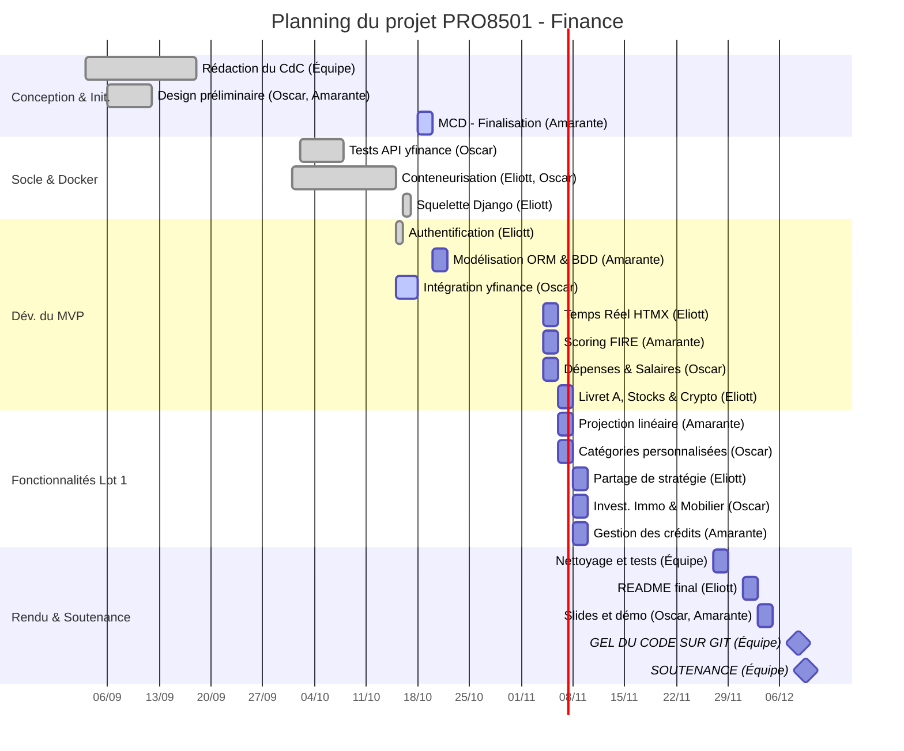

# Bonjour à tous 

je m'apelle eliott

```mermaid
gantt
    title Planning du projet PRO8501 - Finance
    dateFormat  YYYY-MM-DD
    axisFormat  %d/%m

    section Conception & Init.
    Rédaction du CdC (Équipe)             :done, 2026-09-03, 2026-09-18
    Design préliminaire (Oscar, Amarante) :done, 2026-09-06, 2026-09-12
    MCD - Finalisation (Amarante)         :active, 2026-10-18, 2d

    section Socle & Docker
    Tests API yfinance (Oscar)            :done, 2026-10-02, 2026-10-08
    Conteneurisation (Eliott, Oscar)      :done, 2026-10-01, 2026-10-15
    Squelette Django (Eliott)             :done, 2026-10-16, 1d

    section Dév. du MVP
    Authentification (Eliott)             :done, 2026-10-15, 2026-10-16
    Modélisation ORM & BDD (Amarante)     :2026-10-20, 2d
    Intégration yfinance (Oscar)          :active, 2026-10-15, 3d
    Temps Réel HTMX (Eliott)              :2026-11-04, 2d
    Scoring FIRE (Amarante)               :2026-11-04, 2d
    Dépenses & Salaires (Oscar)           :2026-11-04, 2d
    Livret A, Stocks & Crypto (Eliott)    :2026-11-06, 2d

    section Fonctionnalités Lot 1
    Projection linéaire (Amarante)        :2026-11-06, 2d
    Catégories personnalisées (Oscar)     :2026-11-06, 2d
    Partage de stratégie (Eliott)         :2026-11-08, 2d
    Invest. Immo & Mobilier (Oscar)       :2026-11-08, 2d
    Gestion des crédits (Amarante)        :2026-11-08, 2d

    section Rendu & Soutenance
    Nettoyage et tests (Équipe)           :2026-11-27, 2d
    README final (Eliott)                 :2026-12-01, 2d
    Slides et démo (Oscar, Amarante)      :2026-12-03, 2d
    GEL DU CODE SUR GIT (Équipe)          :milestone, 2026-12-08, 1d
    SOUTENANCE (Équipe)                   :milestone, 2026-12-09, 1d
```